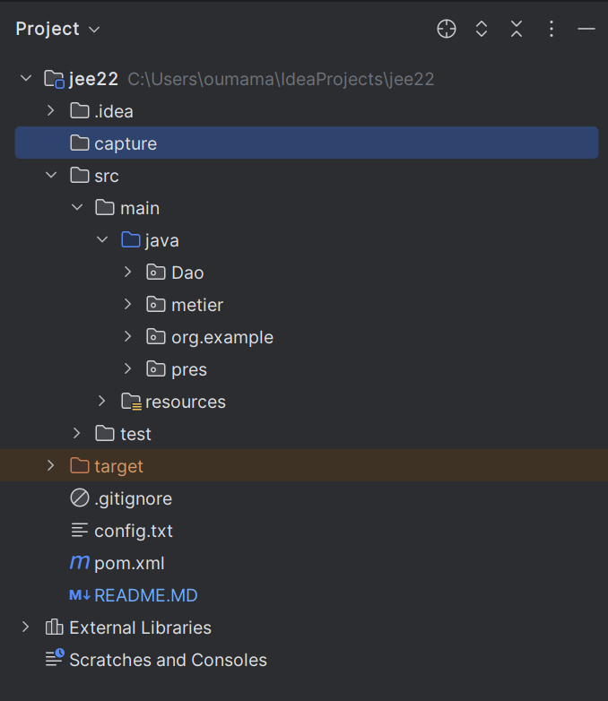
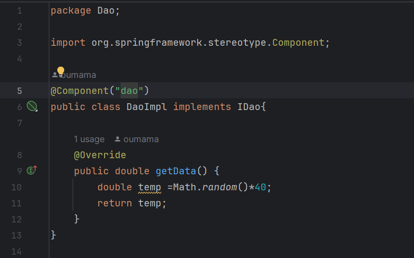
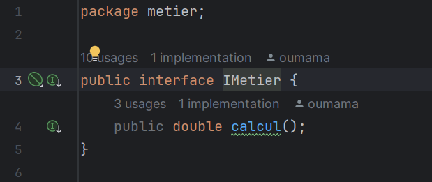
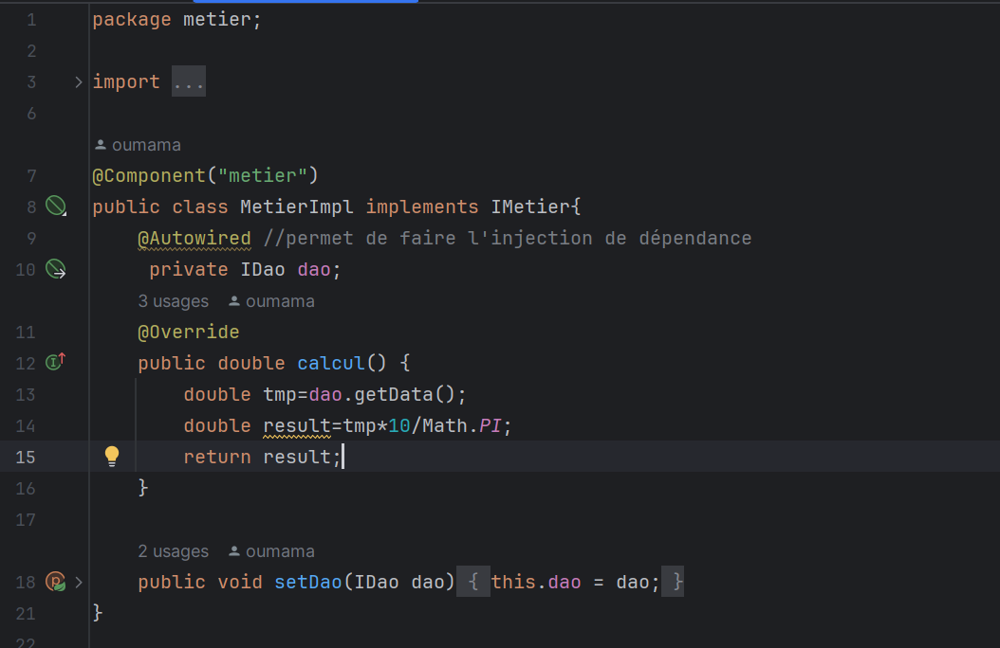
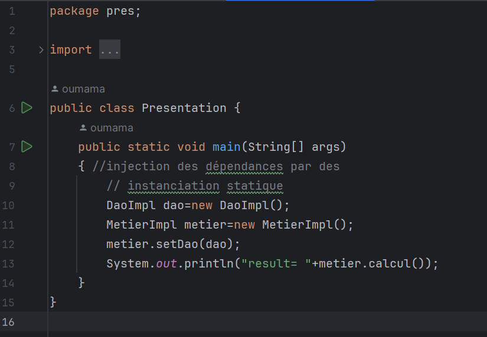
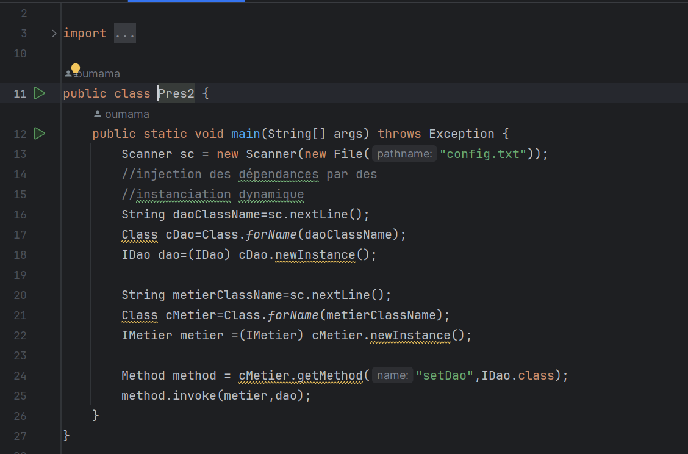
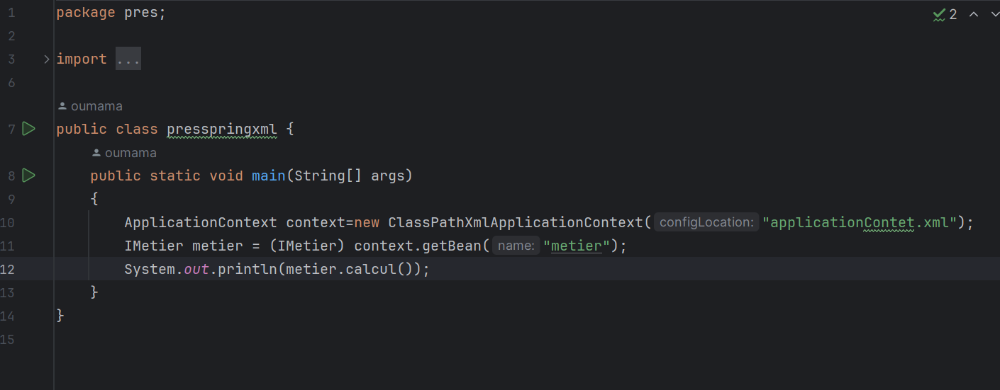

 <h3>COMPTE RENDU </h3>
 #### capture d'écran 
 <h6> project tree </h6>

<h6> interface IDao : </h6>

<h6> implementation de l'interface IDao : </h6>

<h6> interface IMetier : </h6>

<h6> implementation de l'interface IMetier : </h6>

<h6> injection des dépendances  : </h6>
            <h8> instanciation statique  </h8>

<h8> instanciation dynamique  </h8>

<h8> en utilisant framework spring  </h8>
<h8> version xml </h8>

<h8> version annotations </h8>

